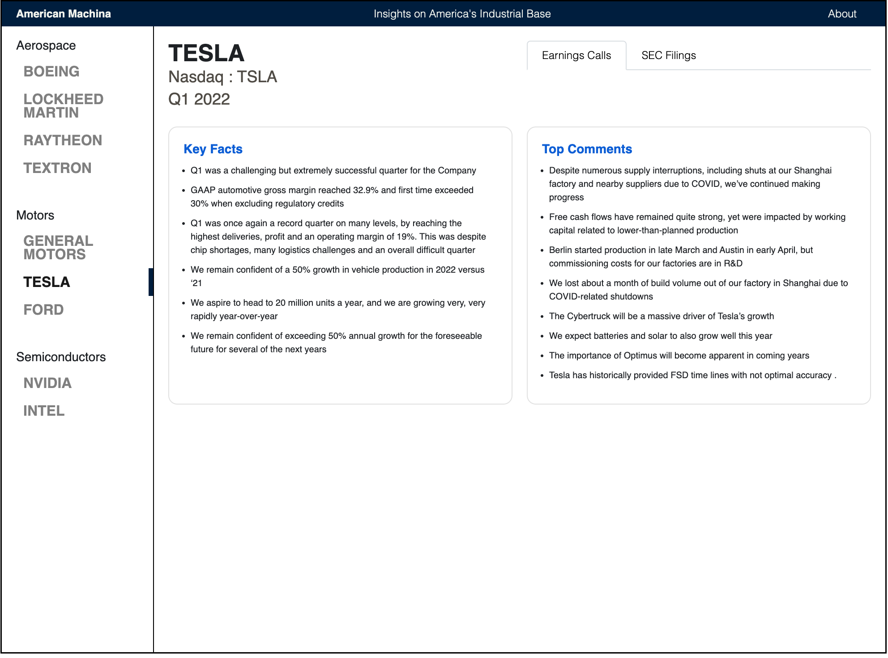

## Earnings calls summaries using transformers

### Background

Earnings calls are quarterly events where management presents the company's outlook and it’s followed by probing questions from investment analysts.

Earnings Calls are a key source of information to understand a company’s state of affairs and includes forward looking statements. 

### Problem 

Reading through a 5-10 page earnings call transcript takes an investor 30mins to 1hr so instead they read summaries provided by media outlets like news and finance apps. The summarization is done by 2-3 analysts from these firms. 

The value of an Earnings Call summarizer can be measured in Investor time saved and the increased productivity of a financial analyst using this tool.

### Hypotheses
1. Analysts using a transformer summarizer will be more productive by reducing their work by 90% while maintaining their output.
2. The cost of producing an analyst-only Earnings Call summary is 0.5 hrs X 3 analysts X 50USD/hr: 75 USD / summary. 

### Milestones
1. Build summarization pipeline with an out-of-the-box transformer *[done]*.
2. Run pipeline on sample Earnings Call transcripts for 9 sample companies *[done]*. 
3. Build UI to present example summaries *[done]*.
4. Gather feedback on summary quality and desirability *[ongoing]*.
5. Fine-tune model to improve summary quality [not started].
6. Test other ideas [not started]
    - Train discriminator model to discern between investor-critical sentences in summary.
    - Let user do open ended questions and get answers from model.
    - Use model to generate questions and answers using the call as context.
7. Summarize Earnings Calls for all public companies.

[Running notes](https://docs.google.com/document/d/1PzdC75WmWBSBCSfoIXo0CoddJNC-Af8Xfs-dE4hha4c/edit?usp=sharing)
